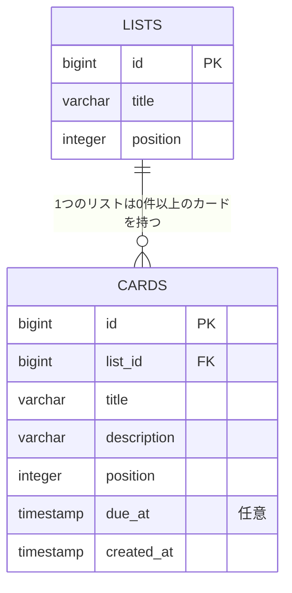

# データベース設計書

Trello風タスク管理アプリ(架空案件)のデータベース設計書。対象は `backend/`(Java + Spring Boot + Spring Data JPA)が接続する PostgreSQL データベース。

機能要件・API仕様は [requirements.md](requirements.md)(要件定義書)、依頼者ニーズの背景は [needs-analysis.md](needs-analysis.md)(要求分析書)を参照。

## 1. 概要

| 項目 | 内容 |
|---|---|
| RDBMS | PostgreSQL 17(`postgres:17-alpine`) |
| 実行環境(開発時) | Docker Compose(`backend/compose.yaml`。`./gradlew bootRun` 時に自動起動・停止) |
| テーブル定義の管理方法 | Spring Data JPA(Hibernate)のエンティティクラスから自動生成(`spring.jpa.hibernate.ddl-auto=update`) |
| DB名 / ユーザー | `taskmanagement` / `taskmanagement` |

> **状態**: テーブル(`lists`・`cards`)とJPAエンティティは作成済み。READ系(`GET /api/lists`)のみAPIエンドポイントを実装済み、それ以外のCRUD(POST/PATCH/DELETE)は未実装(次段階)。動作確認用のテストデータは `backend/src/main/resources/data.sql` で投入している。詳細は requirements.md の「12. 検討・変更の経緯」を参照。

## 2. ER図

`lists`(リスト)1件に対して `cards`(カード)は0件以上(1対多)。カードは必ずいずれか1つのリストに属し、リストが削除されると所属するカードもまとめて削除される(`ON DELETE CASCADE`)。



## 3. テーブル定義

### 3.1 lists

| カラム | 型 | 制約 | 備考 |
|---|---|---|---|
| id | bigint | PRIMARY KEY, identity(自動採番) | |
| title | varchar(255) | NOT NULL | リスト名 |
| position | integer | NOT NULL | 表示順(0始まり) |

### 3.2 cards

| カラム | 型 | 制約 | 備考 |
|---|---|---|---|
| id | bigint | PRIMARY KEY, identity(自動採番) | |
| list_id | bigint | NOT NULL, FOREIGN KEY → lists(id) ON DELETE CASCADE | 所属リスト |
| title | varchar(255) | NOT NULL | カード名 |
| description | varchar(255) | NOT NULL, デフォルト `''` | 詳細説明 |
| position | integer | NOT NULL | リスト内での表示順(0始まり) |
| due_at | timestamp | NULL可 | 予定日時(いつやるか)。未設定なら`NULL` |
| created_at | timestamp | NOT NULL | 作成日時。アプリ側で自動設定(`@CreationTimestamp`) |

## 4. JPAエンティティとの対応

| テーブル | エンティティクラス | ファイル |
|---|---|---|
| lists | `TaskList`(`java.util.List`との名前衝突を避けるためエンティティ名は`TaskList`。`@Table(name = "lists")`でテーブル名のみ`lists`を指定) | `backend/src/main/java/com/taskmanagement/backend/entity/TaskList.java` |
| cards | `Card` | `backend/src/main/java/com/taskmanagement/backend/entity/Card.java` |

- `Card.list`(`@ManyToOne`)⇔`TaskList.cards`(`@OneToMany(mappedBy = "list")`)で双方向に関連付け。
- `TaskList`側に`cascade = CascadeType.ALL, orphanRemoval = true`を設定し、アプリ経由でリストを削除した際にカードも削除される(JPAレベルの挙動)。
- `Card.list`側に`@OnDelete(action = OnDeleteAction.CASCADE)`(Hibernate拡張)を設定し、DBの外部キー制約自体にも`ON DELETE CASCADE`を反映(アプリを介さずSQLで直接削除した場合も整合性を保つ)。

## 5. 命名・型に関する補足

- 旧Node.js/SQLite版では `id` を`INTEGER`、日時を`TEXT`(ISO文字列)で保持していたが、PostgreSQL移行に伴い `id` は`bigint`(identity)、日時は`timestamp`型に変更した。
- `spring.jpa.hibernate.ddl-auto=update` は開発時の簡易運用であり、スキーマが安定した段階でFlywayなどのマイグレーションツールへの切り替えを検討する(requirements.md 12. 検討・変更の経緯を参照)。

## 6. 動作確認方法

専用の確認用APIは設けていない(方針: 余計なエンドポイントを持たない)。以下の方法で確認する。

```bash
cd backend
./gradlew bootRun   # compose.yamlのPostgreSQLが自動起動し、起動時にテーブルが作成/更新される

# 別ターミナルから、コンテナに直接接続してスキーマを確認
docker exec backend-postgres-1 psql -U taskmanagement -d taskmanagement -c "\d lists"
docker exec backend-postgres-1 psql -U taskmanagement -d taskmanagement -c "\d cards"
```
