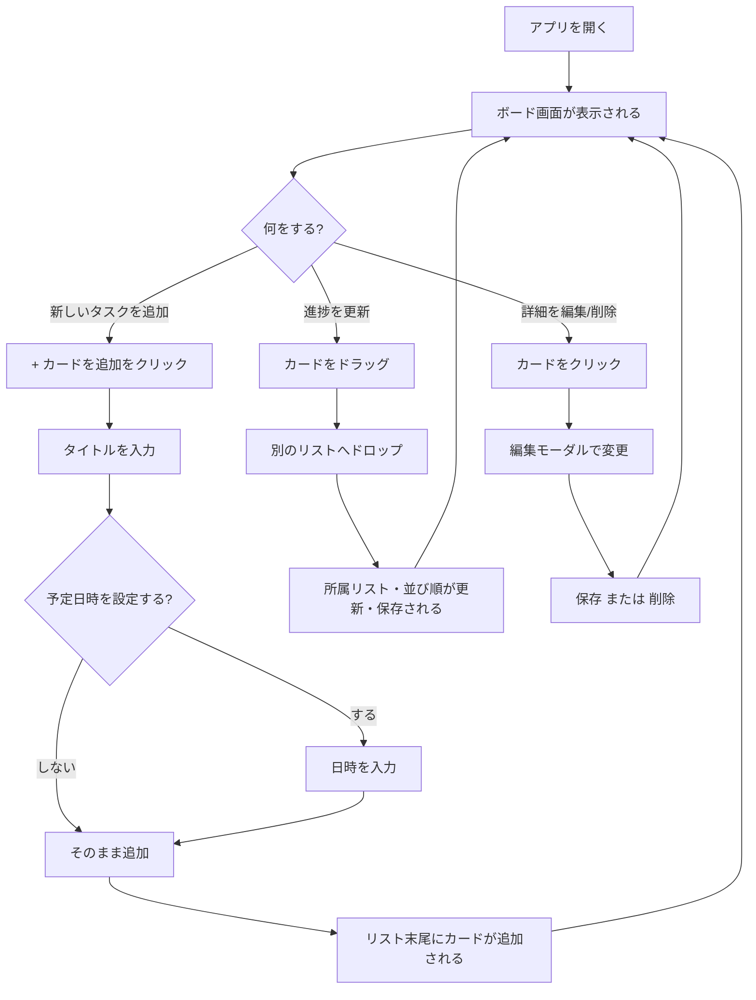
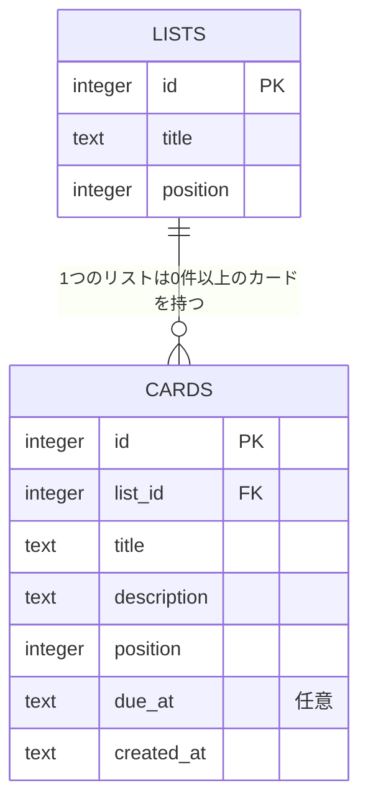

# Task Board 要件定義書

- 作成日: 2026-08-20
- プロジェクト: task_management / Task Board(トレロ風タスク管理アプリ、演習)
- 関連文書: [needs-analysis.md](needs-analysis.md)(要求分析書。本書の前提となる依頼者ニーズを整理したもの)

## 1. 概要

Trello を参考にした、個人利用向けのタスク管理Webアプリケーションを開発する。
リストとカードによるカンバン方式のタスク管理を、デスクトップのブラウザで利用できる形で提供する。
これは架空案件であり、**開発者本人が今後の個人スケジュールを管理するためのアプリ**と位置づける。

## 2. 対象ユーザー・用途

- 開発者本人(個人利用)。ログイン機能・複数ユーザー・複数ボードの管理は対象外。
- 用途: 仕事・プライベートを問わず、個人の今後の予定・タスクをリスト(進捗状況)ごとに整理し、予定日時を添えて管理すること。

## 3. 用語定義

| 用語 | 意味 |
|---|---|
| リスト | カードをまとめる列(例: 未着手 / 実行中 / 完了)。トレロの「リスト」に相当。 |
| カード | 個々のタスク。タイトル・説明・予定日時を持つ。 |
| 予定日時 | カードに任意で設定する日時。「いつまでにやるか(締切)」ではなく「いつやるか」を表す。 |

## 4. 機能要件

### 4.1 リスト管理
- リストの新規作成ができる。
- リスト名をクリックしてインライン編集(リネーム)できる。
- リストを削除できる(カードが残っている場合は確認ダイアログを表示)。
- 初回起動時、`未着手` / `実行中` / `完了` の3リストを初期データとして自動生成する。

### 4.2 カード管理
- リストの末尾にカードを新規作成できる。
- カードをクリックすると編集モーダルが開き、タイトル・説明・予定日時を編集できる。
- カードを削除できる(確認ダイアログを表示)。

### 4.3 予定日時(任意設定)
- カードごとに、予定日時を設定するかどうかをチェックボックス(「予定日時を設定する」)で選択できる。設定しない場合はカードに日時情報を持たない。
- 設定した予定日時は、カード上に年月日時分(例: `2026/10/1 10:30`)のバッジとして表示する。
- 予定日時が現在時刻を過ぎているカードは赤色、24時間以内に迫っているカードはオレンジ色でバッジを表示する(締切超過ではなく「予定を過ぎても未完了」の目印として継続表示する)。
- 日時入力欄は西暦2000年〜2100年の範囲に制限し、誤入力(桁数の異常な値など)を防止する。

### 4.4 ドラッグ&ドロップ
- カードをマウスでドラッグし、同一リスト内での並び替え、および別リストへの移動ができる。
- 移動結果はサーバー側に永続化され、リロード後も保持される。

### 4.5 背景カスタマイズ
- ボード(アプリ全体)の背景を、プリセットカラー(ブルー/オレンジ/グリーン/レッド/パープル/スカイ/グレー/ホワイトの8色)から選択できる。
- ローカルの画像ファイルをアップロードし、背景画像として設定できる。
  - アップロード時に自動でリサイズ・圧縮(最大辺1920px、JPEG品質0.82)し、保存容量を抑える。
  - 「画像を解除」操作で背景色設定に戻せる。
- 背景画像はウィンドウサイズに応じて常に画面全体を覆うように表示する(`background-size: cover`)。ウィンドウのリサイズに追従する。
- 外部サービス(Unsplash等)からの画像検索・取得機能は対象外とする(検討したが、API キー取得の手間を避けるためローカルアップロード方式を採用)。
- 背景設定はカード/リストのデータとは別に、実行環境のローカルストレージに保存する(サーバー側DBには保存しない)。

## 5. 非機能要件

### 5.1 実行形態
- デスクトップのブラウザで開いて使う Web アプリケーションとする。
  - 検討過程: 当初「ブラウザで開くWebアプリ」として実装 → 「ブラウザを開かなくても使えるか」という確認を経て一時Electronによるデスクトップアプリ化に方針変更 → 最終的にWebアプリ方式に戻すことで確定した。Electron版一式は不要になったためリポジトリから削除済み。
- 画面レイアウトはレスポンシブデザインとする。デスクトップ幅ではリストを横並びに表示し、スマートフォン等の狭い画面(目安: 768px以下)ではリストを縦に積み重ねて表示する。
  - 検討過程: 当初はデスクトップ専用(スマホ非対応)としていたが、非機能要件を見直しレスポンシブ対応に方針変更した。

### 5.2 データ永続化
- リスト・カードのデータは SQLite ファイル(`backend/data/app.db`)に保存し、アプリ再起動後も保持する。
- 文字コードは UTF-8 とし、日本語の入力・表示に対応する。

### 5.3 動作環境
- Node.js 22.5 以上(`node:sqlite` を使用するため。Node.js 24 系で動作確認済み)。
- OS: Windows(動作確認済み)。

### 5.4 対応ブラウザ
- 動作確認済み: Google Chrome(最新版)
- 想定対応(未検証): Microsoft Edge、Firefox、Safari など、他のモダンブラウザ(Evergreenブラウザ)の最新版
- 非対応: Internet Explorer
- 理由: 予定日時入力に `<input type="datetime-local">`、ドラッグ&ドロップに `@dnd-kit`(Pointer Events API)、フロントエンドのビルドにVite(ESモジュール配信)を使用しており、いずれもモダンブラウザでの動作を前提としている。

## 6. 画面要件

| 画面/UI | 内容 |
|---|---|
| ボード画面 | ヘッダー(タイトル・背景ピッカー)、リストを横並びに表示するメイン領域 |
| カード編集モーダル | タイトル・説明・予定日時(チェックボックス+日時入力)・保存/削除ボタン |
| リスト追加フォーム | リスト名を入力して追加 |
| カード追加フォーム | カードタイトル入力、予定日時の任意設定 |

実際に操作できるプロトタイプ(HTML/CSS/JavaScript、単一ファイル、データはブラウザのlocalStorageに保存)を作成済み: [docs/mockup.html](mockup.html)。リスト/カードの追加・編集・削除・ドラッグ&ドロップ・背景カスタマイズなど、要件定義書の機能要件と同等の挙動を試せる(バックエンドは使用しない簡易版)。

## 7. ユースケースと操作フロー

アクターは「利用者(開発者本人)」の1人のみ(2. 対象ユーザー・用途を参照)。

### 7.1 ユースケース一覧

| ID | ユースケース | 対応する機能要件 |
|---|---|---|
| UC1 | ボードを開く | 6. 画面要件(ボード画面) |
| UC2 | リストを作成する | 4.1 |
| UC3 | リスト名を変更する | 4.1 |
| UC4 | リストを削除する | 4.1 |
| UC5 | カードを作成する(予定日時の任意設定含む) | 4.2、4.3 |
| UC6 | カードを編集する | 4.2、4.3 |
| UC7 | カードを削除する | 4.2 |
| UC8 | カードをドラッグ&ドロップで移動する | 4.4 |
| UC9 | 背景をカスタマイズする | 4.5 |

### 7.2 ユースケース記述

**UC1: ボードを開く**
- 事前条件: バックエンド・フロントエンドが起動している。
- 基本フロー:
  1. ブラウザで http://localhost:5173 を開く。
  2. アプリがリスト・カード一覧をサーバーから取得する。
  3. (初回起動時のみ)`未着手` / `実行中` / `完了` の3リストが自動生成された状態で表示される。
- 事後条件: 現在のリスト・カードの状態がボード画面に表示されている。

**UC2: リストを作成する**
- 事前条件: UC1完了。
- 基本フロー: 「+ リストを追加」をクリック → リスト名を入力 → 「追加」(またはEnter) → 一番右に新しいリストが追加される。
- 代替フロー: 名前が空欄のまま追加しようとした場合、何も追加されない。

**UC3: リスト名を変更する**
- 基本フロー: リストのタイトル部分をクリック → インライン編集状態になる → 新しい名前を入力 → Enterまたはフォーカスを外すと確定。

**UC4: リストを削除する**
- 基本フロー: リストのゴミ箱アイコンをクリック → カードが残っている場合は確認ダイアログを表示 → OKでリストとカードがまとめて削除される。

**UC5: カードを作成する**
- 事前条件: 対象リストが存在する。
- 基本フロー:
  1. リスト下部の「+ カードを追加」をクリック。
  2. タイトルを入力する。
  3. 必要な場合のみ「予定日時を設定する」にチェックし、日時を入力する(未チェックなら日時なしで作成)。
  4. 「追加」をクリックすると、リストの末尾にカードが追加される。

**UC6: カードを編集する**
- 基本フロー: カードをクリック → 編集モーダルが開く → タイトル・説明・予定日時(任意)を変更 → 「保存」をクリックして反映。

**UC7: カードを削除する**
- 基本フロー: 編集モーダルを開く → 「削除」をクリック → 確認ダイアログでOK → カードが削除される。

**UC8: カードをドラッグ&ドロップで移動する**
- 基本フロー: カードを掴んでドラッグ → 移動先(同一リスト内の別位置、または別リスト)へドロップ → 並び順・所属リストが更新され、サーバー側に保存される。

**UC9: 背景をカスタマイズする**
- 基本フロー(色): ヘッダーのカラースウォッチをクリック → 背景色が即座に変わり、ローカルストレージに保存される。
- 基本フロー(画像): 「画像を選択」をクリック → 画像ファイルを選択 → 自動でリサイズ・圧縮され背景に設定される → 「画像を解除」で色設定に戻せる。

### 7.3 代表的な操作フロー(タスク追加〜進捗更新)



## 8. データモデル

### 8.1 ER図

`lists`(リスト)1件に対して `cards`(カード)は0件以上(1対多)。カードは必ずいずれか1つのリストに属し、リストが削除されると所属するカードもまとめて削除される(`ON DELETE CASCADE`)。



### 8.2 テーブル定義

```
lists
  id            INTEGER PRIMARY KEY
  title         TEXT NOT NULL
  position      INTEGER NOT NULL

cards
  id            INTEGER PRIMARY KEY
  list_id       INTEGER NOT NULL (FK -> lists.id, ON DELETE CASCADE)
  title         TEXT NOT NULL
  description   TEXT NOT NULL DEFAULT ''
  position      INTEGER NOT NULL
  due_at        TEXT NULL        -- 予定日時(任意、ISO日時文字列)
  created_at    TEXT NOT NULL
```

## 9. バックエンド仕様(APIとその動作)

> **注記**: 本章は目標とする仕様であり、現在の実装(`backend/`、Spring Boot)ではまだ起動確認用の `GET /` のみが動作する(9.1の `/api/lists` `/api/cards` などは未実装)。本文の記述(SQLiteのトランザクション処理など)は旧Node.js版での実装内容に基づくもので、Java版への移植時に改めて設計する。

フロントエンドはすべてのデータ操作をバックエンドのREST APIを介して行う。バックエンドはリクエストを受け取るとSQLiteに対して読み書きを行い、結果をJSONで返す。バリデーションエラーやリソース未検出などの異常系も、例外を投げっぱなしにせずJSON形式のエラーレスポンスとして返す。

### 9.1 APIエンドポイント一覧

| Method | Path | 概要 |
|---|---|---|
| GET | `/api/health` | ヘルスチェック(起動確認用) |
| GET | `/api/lists` | 全リストを、所属カード込み(position順)で取得 |
| POST | `/api/lists` | リストを新規作成(末尾に追加) |
| PATCH | `/api/lists/:id` | リスト名を変更 |
| DELETE | `/api/lists/:id` | リストを削除(所属カードもまとめて削除) |
| POST | `/api/cards` | カードを新規作成(指定リストの末尾に追加) |
| PATCH | `/api/cards/:id` | カードのタイトル・説明・予定日時を更新 |
| PATCH | `/api/cards/:id/move` | カードを別リスト・別位置へ移動(ドラッグ&ドロップ用) |
| DELETE | `/api/cards/:id` | カードを削除 |

### 9.2 主要エンドポイントの動作

- **`GET /api/lists`**: `lists` を `position` 昇順で取得し、それぞれに紐づく `cards` を `position` 昇順でネストして返す。フロントエンドはこの1回のレスポンスだけでボード全体を描画する。
- **`POST /api/cards`**: `list_id` と `title` が必須。`title` が空、または `list_id` に対応するリストが存在しない場合は `400`/`404` を返す。`due_at` は未指定なら `null`(予定日時なし)として保存する。新規カードの `position` は、同じリスト内の最大position+1として末尾に追加する。
- **`PATCH /api/cards/:id/move`**: ドラッグ&ドロップの結果を反映するための専用エンドポイント。移動元・移動先のリストにある他のカードの `position` を、SQLiteのトランザクション(`BEGIN`〜`COMMIT`、失敗時は`ROLLBACK`)内でまとめて振り直すことで、順序の整合性を保つ。
  1. 移動先が同じリスト内の場合: 対象カードを除いた並び順に、指定位置へ挿入し直してから、リスト内全カードの `position` を0から振り直す。
  2. 移動先が別リストの場合: 元のリストは対象カードを除いて `position` を詰め直し、移動先リストには指定位置へ挿入したうえで `list_id` と `position` を更新する。
- **`DELETE /api/lists/:id` / `DELETE /api/cards/:id`**: 削除後、残ったレコードの `position` に欠番が出ないよう詰め直す(リスト削除時は所属カードも先に削除)。

### 9.3 エラーハンドリング方針

- バリデーションエラー(必須項目の欠落など): `400`、`{ "error": "…" }` を返す。
- 対象が存在しない場合(不正な `id` など): `404`。
- 上記以外の想定外の例外は、Expressの共通エラーハンドラーで捕捉し `500` を返す(スタックトレースをそのまま返さずJSON化する)。
- フロントエンド・バックエンドが別ポート(5173 / 3001)で動作するため、`cors` ミドルウェアでクロスオリジンリクエストを許可している。

## 10. 技術構成(技術選定)

> **注記**: 以下は今後移行予定の技術スタックである。バックエンドは `backend/` をSpring Boot版に一本化済み(旧Node.js版は削除)だが、まだ最小構成(ひな形、`GET /` の起動確認のみ)の段階。DB(PostgreSQL)は未接続。フロントエンド(`frontend/`)はまだ移行前(JavaScript、素のCSS)のまま。詳細は12.検討・変更の経緯を参照。

### 10.1 フロントエンド

| 項目 | 技術 |
|---|---|
| フレームワーク | React |
| 言語 | TypeScript |
| ビルドツール | Vite |
| ドラッグ&ドロップ | dnd-kit |
| スタイリング | Tailwind CSS |
| パッケージ管理 | npm |

### 10.2 バックエンド

| 項目 | 技術 |
|---|---|
| 言語 | Java |
| フレームワーク | Spring Boot |
| ビルドツール | Gradle |
| API形式 | REST API |

### 10.3 データベース

| 項目 | 技術 |
|---|---|
| RDBMS | PostgreSQL |

### 10.4 開発ツール

| 項目 | 技術 |
|---|---|
| バージョン管理 | Git + GitHub |

### 10.5 移行前(現行実装)からの変更点

| 項目 | 移行前(現行実装) | 移行後(採用) |
|---|---|---|
| フロントエンド言語 | JavaScript | TypeScript |
| スタイリング | 素のCSS | Tailwind CSS |
| バックエンド | Node.js + Express | Java + Spring Boot(Gradle) |
| データベース | SQLite(`node:sqlite`) | PostgreSQL |
| ドラッグ&ドロップ | `@dnd-kit`(変更なし) | `dnd-kit`(変更なし) |

## 11. スコープ外(今回対応しないこと)

- ユーザー登録・ログイン・複数アカウント対応
- 複数ボードの作成・切り替え
- Unsplash等の外部画像検索連携
- デスクトップアプリ化(Electron等によるパッケージ配布)

## 12. 検討・変更の経緯

開発は要件を一度に確定せず、動くものを確認しながら段階的に決定した。主な方針変更は以下の通り。

1. 技術スタックとして React + Node/Express + SQLite(基本機能のみ)を選定。
2. 実行形態を確認した結果、「ブラウザで使うWebアプリ」から「ブラウザ不要のElectronデスクトップアプリ」に変更。
3. スマートフォン対応の要否を確認し、デスクトップ専用のまま進める方針に確定。
4. 日時フィールドを「期限(締切)」ではなく「予定日時(いつやるか)」という意味合いに変更。
5. 背景カスタマイズ機能を追加。Unsplash連携を検討したが、APIキー取得の手間を避けローカル画像アップロード方式に決定。
6. 実行形態を再検討し、Electronデスクトップアプリから「デスクトップのブラウザで使うWebアプリ」に方針を戻した。Electron版一式(`electron/`)はリポジトリから削除した。
7. リポジトリ名を `RaiseTech_Course_AI_Engineer` から `task_management` に変更(ローカルフォルダ名・GitHub上のリポジトリ名の両方)。
8. アプリの位置づけを明確化し、「開発者本人が今後の個人スケジュールを管理するためのアプリ(架空案件)」として定義した。
9. [needs-analysis.md](needs-analysis.md)(要求分析書)を作成し、依頼者の現状(カレンダー・メモアプリ利用)と課題(進捗状況が一目でわからない)を整理したうえで、各機能要件との対応を明確化した。
10. 非機能要件を見直し、デスクトップ専用からレスポンシブデザイン(狭い画面ではリストを縦に積み重ねる)に方針変更した。
11. ユースケースと操作フローが未整理だったため、「7. ユースケースと操作フロー」を要件定義書に追加した(要件定義書内に含める形とし、別ファイルには分けない方針とした)。
12. 「9. 技術構成」が採用技術の一覧(結果)のみで選定理由(プロセス)を含んでいなかったため、選定理由と不採用技術の検討結果を統合した。
13. 「8. データモデル」にER図(Mermaid)を追加し、`lists` と `cards` の1対多の関係を視覚的に示した。
14. バックエンドが方針レベル(技術構成)でしか記載されておらず、実際の動作仕様が抜けていたため、「9. バックエンド仕様(APIとその動作)」を新設し、APIエンドポイント一覧・主要処理の動作・エラーハンドリング方針を明記した。
15. 非機能要件に「5.4 対応ブラウザ」を追加し、動作確認済みのブラウザ(Chrome)と想定対応ブラウザを明記した。
16. 「6. 画面要件」の裏付けとして、ボード画面・カード編集モーダルのモックアップを作成し、リンクを追加した。当初はClaude Designのキャンバスエディタ形式で作成 → 素のHTML/CSSファイルにしてほしいという要望を受け静的HTMLに作り直し → さらに「実際の要件に合わせた挙動ができること」という要望を受け、JavaScriptを追加してリスト/カードのCRUD・ドラッグ&ドロップ・背景カスタマイズが実際に動くプロトタイプ(`docs/mockup.html`、バックエンドなし・localStorageで保持)へと発展させた。
17. 初期リスト名を `To Do` / `In Progress` / `Done`(英語表記)から `未着手` / `実行中` / `完了`(日本語表記)に変更した。対象は要件定義書・要求分析書の記載、およびプロトタイプ(`docs/mockup.html`)の初期データ。バックエンドの実装(`backend/db.js`)や稼働中アプリのDBデータは対象外とした。
18. プロトタイプ(`docs/mockup.html`)のカード並び替えUXを改善。ドロップ時に一括計算していた方式から、ドラッグ中にカードをリアルタイムで動かす方式に変更。あわせて、修正過程で見つかった別リスト移動時の不具合(ドラッグ対象の判定タイミング・状態再構築時の参照ロスト)も修正した。
19. 技術スタックを大幅に変更する方針を決定。フロントエンドはJavaScript→TypeScript・素のCSS→Tailwind CSSに、バックエンドはNode.js/Express→Java/Spring Boot(Gradle)に、データベースはSQLite→PostgreSQLに移行する。まずは要件定義書(10.技術構成)の記載を新方針に更新し、実装(`backend/`, `frontend/`)自体の移行は別途行う。
20. バックエンド移行の第一歩として、Spring Bootの最小構成(ひな形)を `backend-java/` に新規作成した。JDK 25(LTS)をwingetで導入し、Spring Initializr経由でGradleプロジェクト(Spring Boot 4.1.1、Java toolchain 25)を生成。依存関係は Web・Spring Data JPA・H2・Actuator。DBは本来の目標であるPostgreSQLの代わりに、当面H2(インメモリ)を使用(PostgreSQL/Dockerが未インストールのため)。`GET /api/health`(既存Node版と同じ契約)と、DB接続状況を含む `GET /actuator/health` の両方が正常に動作することを確認済み。既存のNode版 `backend/` はまだ置き換えておらず、当面併存する。
21. 「正規版アプリのデプロイはまだ先であり、旧Node版は削除して問題ない」との判断により、旧Node.js版バックエンド(`backend/`)を完全に削除し、`backend-java/` を `backend/` にリネームして正式なバックエンドディレクトリとした(Git履歴には旧実装が残る)。`docs/mockup.html`(プロトタイプ)はバックエンドを呼び出さない独立ファイルのため無影響。副作用として、Java版はまだヘルスチェックのみのため、`frontend/` から `backend/` への実際のAPI呼び出し(リスト/カードのCRUD等)は本項時点では動作しない。
22. 「この段階でDBの代替(H2)は不要。むしろ未整備であることが正しく分かるよう、あえて異常ステータスにしてほしい」との方針を受け、H2・Spring Data JPAへの依存を撤去した。代わりに自作の `DatabaseHealthIndicator`(`org.springframework.boot.health.contributor.HealthIndicator` を実装。Spring Boot 4系ではヘルス関連APIが `spring-boot-actuator` から `spring-boot-health` モジュール・`org.springframework.boot.health.contributor` パッケージへ移動している点に注意)を追加し、DB未接続を `database: DOWN` として正直に報告するようにした。`GET /actuator/health` は総合ステータス `DOWN`(HTTP 503)を返す。`GET /api/health`(アプリ自体の起動確認)は引き続き `{"status":"ok"}` のまま。
23. 「`/api/health` と `/actuator/health` はどちらも必須ではない。今必要なのはルート(`http://localhost:8080/`)のみ」との方針を受け、両エンドポイントおよびActuator依存(`DatabaseHealthIndicator` 含む)を削除。`GET /`(`RootController`)のみで `{"status":"ok"}` を返す、最小構成に戻した。
